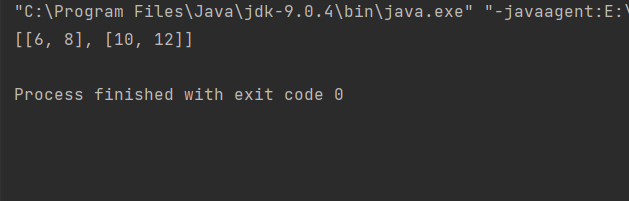

### Варіант 7
Знайти суму двох матриць розміром N x M.

### Опис
Даний код містить реалізацію класу Sum, який знаходить суму двох матриць розміром N x M, а також інтерфейс Matrix, який визначає метод getMatrix() для отримання матриці. Крім того, у файлі MatrixTest міститься приклад використання класу Sum та інтерфейсу Matrix.

Клас Sum містить статичний метод sum, який приймає дві матриці у вигляді двовимірних масивів a та b. Метод повертає нову матрицю c, яка є сумою матриць a та b.

Інтерфейс Matrix містить метод getMatrix(), який повертає двовимірний масив цілих чисел - матрицю.

У файлі MatrixTest ми створюємо дві матриці a та b, а потім створюємо два об'єкти-анонімні класи, які реалізують інтерфейс Matrix та повертають матриці a та b відповідно. Потім ми викликаємо метод Sum.sum() з матрицями a та b та зберігаємо результат у змінну c. Нарешті, ми виводимо значення матриці c за допомогою методу Arrays.deepToString().

### Результат роботи програми

